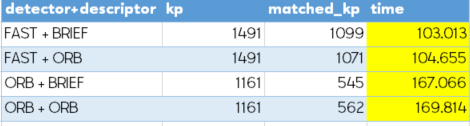
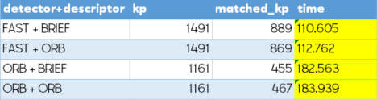

# SFND 2D Feature Tracking

Example: HARRIS + BRIEF:

Result test using Selector Type SEL_KNN:

Results using Matcher Type MAT_BF:

Results using Matcher Type MAT_FLANN:

Top 3+1 pairs:
Selected by your short process time.

MAT_BF:

MAT_FLANN:

## Basic Build Instructions

1. Clone this repo.
2. Make a build directory in the top level directory: `mkdir build && cd build`
3. Compile: `cmake .. && make`
4. Run it: `./2D_feature_tracking`.
