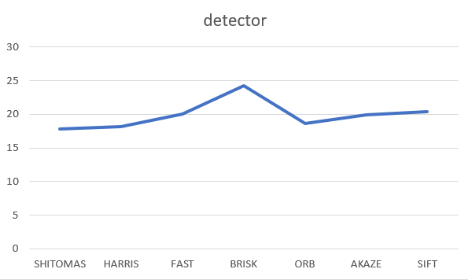

# SFND 3D Object Tracking


## Project Rubric Points

#### 1. FP.1 Match 3D Objects
In this task, please implement the method "matchBoundingBoxes", which takes as input both the previous and the current data frames and provides as output the ids of the matched regions of interest (i.e. the boxID property)“. Matches must be the ones with the highest number of keypoint correspondences.

#### Result:
```
void matchBoundingBoxes(std::vector<cv::DMatch> &matches, std::map<int, int> &bbBestMatches, DataFrame &prevFrame, DataFrame &currFrame)
{
    // ...
    int prevKpIdx, currKpIdx;
    cv::KeyPoint prevKp, currKp;

    int pSize = prevFrame.boundingBoxes.size();
    int cSize = currFrame.boundingBoxes.size();
    int counts[pSize][cSize] = {};

    vector<int> prevBoxesIds, currBoxesIds;

    for(auto it1=matches.begin(); it1!= matches.end(); ++it1){
        prevKpIdx = (*it1).queryIdx;
        currKpIdx = (*it1).trainIdx;

        prevKp = prevFrame.keypoints[prevKpIdx];
        currKp = currFrame.keypoints[currKpIdx];

        prevBoxesIds.clear();
        currBoxesIds.clear();

        for(auto it2 = prevFrame.boundingBoxes.begin(); it2!= prevFrame.boundingBoxes.end(); ++it2){
            if((*it2).roi.contains(prevKp.pt)){
                prevBoxesIds.push_back((*it2).boxID);
            }
        }

        for(auto it2 = currFrame.boundingBoxes.begin(); it2!= currFrame.boundingBoxes.end(); ++it2){
            if((*it2).roi.contains(prevKp.pt)){
                currBoxesIds.push_back((*it2).boxID);
            }
        }

        for(auto prevId:prevBoxesIds){
            for(auto currId:currBoxesIds){
                counts[prevId][currId]++;
            }
        }
    }

    int maxCount=0, maxId;
    for(int prevId=0; prevId<pSize; prevId++){
        maxCount = 0;
        for(int currId=0; currId<cSize; currId++){
            if (counts[prevId][currId] > maxCount){
                maxCount = counts[prevId][currId];
                maxId = currId;
            }
        }
        bbBestMatches[prevId] = maxId;
    }
}
```

#### 2. FP.2 Compute Lidar-based TTC
In this part of the final project, your task is to compute the time-to-collision for all matched 3D objects based on Lidar measurements alone. Please take a look at the "Lesson 3: Engineering a Collision Detection System" of this course to revisit the theory behind TTC estimation. Also, please implement the estimation in a way that makes it robust against outliers which might be way too close and thus lead to faulty estimates of the TTC. Please return your TCC to the main function at the end of computeTTCLidar.

### Result:

```
void computeTTCLidar(std::vector<LidarPoint> &lidarPointsPrev,
                     std::vector<LidarPoint> &lidarPointsCurr, double frameRate, double &TTC)
{
    // ...
    double prevX=0, currX=0, speed;
    if(!lidarPointsPrev.size() || !lidarPointsCurr.size()){
        TTC = NAN;
        return;
    }
    for(auto it = lidarPointsPrev.begin(); it!= lidarPointsPrev.end(); ++it){
        prevX += (*it).x;
    }
    prevX/=lidarPointsPrev.size();

    for(auto it = lidarPointsCurr.begin(); it!= lidarPointsCurr.end(); ++it){
        currX += (*it).x;
    }
    currX/=lidarPointsCurr.size();

    speed = (prevX - currX) / (1/frameRate);
    if(speed<0){
        TTC = NAN;
        return;
    }
    TTC = currX/speed;
}
```

#### 3. FP.3 Associate Keypoint Correspondences with Bounding Boxes
Before a TTC estimate can be computed in the next exercise, you need to find all keypoint matches that belong to each 3D object. You can do this by simply checking whether the corresponding keypoints are within the region of interest in the camera image. All matches which satisfy this condition should be added to a vector. The problem you will find is that there will be outliers among your matches. To eliminate those, I recommend that you compute a robust mean of all the euclidean distances between keypoint matches and then remove those that are too far away from the mean.

### Result:
```
void clusterKptMatchesWithROI(BoundingBox &boundingBox, std::vector<cv::KeyPoint> &kptsPrev, std::vector<cv::KeyPoint> &kptsCurr, std::vector<cv::DMatch> &kptMatches)
{
    // ...
    std::vector<cv::DMatch> kptMatchesROI;
    double avgDistance = 0.0f;
    double threshold = avgDistance * 0.8;

    for(auto &match : kptMatches){
        if(boundingBox.roi.contains(kptsCurr.at(match.trainIdx).pt)){
            kptMatchesROI.push_back(match);
        }
    }

    if(kptMatchesROI.size() > 0){
        for(auto itr = kptMatchesROI.begin(); itr != kptMatchesROI.end(); itr++){
            avgDistance += itr->distance;
        }
        avgDistance /= kptMatchesROI.size();
    }
    else{
        return;
    }

    for(auto &itr : kptMatchesROI){
        if (itr.distance < threshold){
            boundingBox.kptMatches.push_back(itr);
        }
    }
}
```

#### 4. FP.4 Compute Camera-based TTC
Once keypoint matches have been added to the bounding boxes, the next step is to compute the TTC estimate. As with Lidar, we already looked into this in the second lesson of this course, so you please revisit the respective section and use the code sample there as a starting point for this task here. Once you have your estimate of the TTC, please return it to the main function at the end of computeTTCCamera.

### Result:
```
void computeTTCCamera(std::vector<cv::KeyPoint> &kptsPrev, std::vector<cv::KeyPoint> &kptsCurr, 
                      std::vector<cv::DMatch> kptMatches, double frameRate, double &TTC, cv::Mat *visImg)
{
    // ...
    vector<double> distRatios;

    for (auto it1 = kptMatches.begin(); it1 != kptMatches.end() - 1; ++it1){
        cv::KeyPoint kpOuterCurr = kptsCurr.at(it1->trainIdx);
        cv::KeyPoint kpOuterPrev = kptsPrev.at(it1->queryIdx);

        for (auto it2 = kptMatches.begin() + 1; it2 != kptMatches.end(); ++it2){
            double minDist = 70.0; 
            cv::KeyPoint kpInnerCurr = kptsCurr.at(it2->trainIdx);
            cv::KeyPoint kpInnerPrev = kptsPrev.at(it2->queryIdx);
            double distCurr = cv::norm(kpOuterCurr.pt - kpInnerCurr.pt);
            double distPrev = cv::norm(kpOuterPrev.pt - kpInnerPrev.pt);
            if(distPrev > std::numeric_limits<double>::epsilon() && distCurr >= minDist){
                distRatios.push_back(distCurr / distPrev);
            }
        }
    }
    if (distRatios.size() == 0){
        TTC = NAN;
        return;
    }
    std::sort(distRatios.begin(), distRatios.end());
    long medIndex = floor(distRatios.size() / 2.0);
    double medDistRatio = distRatios.size() % 2 == 0 ? (distRatios[medIndex - 1] + distRatios[medIndex]) / 2.0 : distRatios[medIndex];
    double dT = 1 / frameRate;
    TTC = -dT / (1 - medDistRatio);

}
```

#### 5. FP.5 Performance Evaluation 1
This exercise is about conducting tests with the final project code, especially with regard to the Lidar part. Look for several examples where you have the impression that the Lidar-based TTC estimate is way off. Once you have found those, describe your observations and provide a sound argumentation why you think this happened.

The task is complete once several examples (2-3) have been identified and described in detail. The assertion that the TTC is off should be based on manually estimating the distance to the rear of the preceding vehicle from a top view perspective of the Lidar points.

### Result:
Vertical axis: TTC and horizontal axis N frames.  
  

As you can see in the graphic above, some strong and strange changes are between some frames, for example 2-3-4 and 16-17-18-19.
I do a focus in the first group with the next captures:  

frame 1
  

Focus here: frame 2
  

Focus here: frame 3
  

Focus here: frame 4
  

frame 5
  

In the above captures yo ucan see the road with the in front car selected and below this the lidar top view.
The distance between the blue lines is 1 meter.
As you can see the variation distance exist, but is very low.

Perhaps the variation is for some points reflected by others cars.

But the TTC variation come from the calculation of this with the small distance changes.(I think).  


#### 6. FP.6 Performance Evaluation 2
This last exercise is about running the different detector / descriptor combinations and looking at the differences in TTC estimation. Find out which methods perform best and also include several examples where camera-based TTC estimation is way off. As with Lidar, describe your observations again and also look into potential reasons. This is the last task in the final project.

The task is complete once all detector / descriptor combinations implemented in previous chapters have been compared with regard to the TTC estimate on a frame-by-frame basis. To facilitate the comparison, a spreadsheet and graph should be used to represent the different TTCs.

### Result:
For analyse the ouput data with the diferent parameters I create a .csv file with the main values.
Analysing this .csv I can create the next graphics:

### Time:
This graphic compute the median time for all the 18 frames usign in the project.  

  

This graphic compute the median time for all the 18 frames for all the descriptors (BRISK, BRIEF, ORB, FREAK) for each detector (SHITOMASI, HARRIS, FAST, BRISK, ORB, AKAZE, SIFT).  

  

As you can see the detector BRISK is usually more slow and perhaps SHIFT could have better results but in the project I can´t process SIFT detector with all the descriptors.  

### TTC Camera:
In the next 3 chards you can see the TTC calculated for the first frame until the third with the all diffrent detectors, all with BRISK (I take BRISK but is posible use other).  

Frame 1:
  

Frame 2:
  

Frame 3:
  

You can see a "similar" form in the 3 graphics, in the 3rd frame, HARRIS + BRISK is perhaps a outlier procuced by a error (That I don´t study).
We can analyze with this data that the diffrent detectors implican diffrent TTC results for the same frame.

In the next graphics you can see a study for the TTC Camera results for SHITOMASI, HARRIS, FAST and BRISk for all the descriptor (BRISK, BRIEF, ORB, FREAK).  


  

The above study was does for check if some par of detector + descriptor is more robusted that other.
For example for SHITOMASI I can reject use BRISk because produce a wrong result in the frame 10.

You can see all the result in the .csv file:


## Basic Build Instructions

1. Clone this repo.
2. Make a build directory in the top level project directory: `mkdir build && cd build`
3. Compile: `cmake .. && make`
4. Run it: `./3D_object_tracking`.