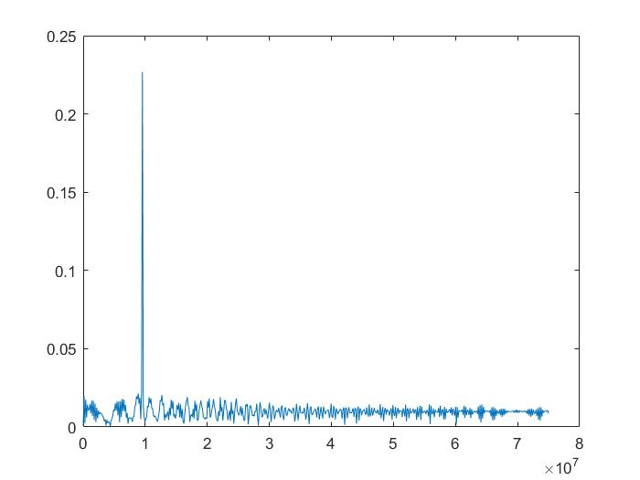

# Radar_Target_Generation_and_Detection

#### Click in the image above for see the video project overview!
[](https://youtu.be/DIVmHps0G8M)


## Project Rubric Points

#### 1. FMCW Waveform Design
Using the given system requirements, design
a FMCW waveform. Find its Bandwidth (B), chirp time (Tchirp) and slope of the chirp.

#### 2. Simulation Loop
Simulate Target movement and calculate the beat or mixed signal for every timestamp.

#### 3. Range FFT (1st FFT)
Implement the Range FFT on the Beat or Mixed Signal and plot the result.

#### 4. 2D CFAR
Implement the 2D CFAR process on the output of 2D FFT operation, i.e the Range Doppler Map.


## Radar Specifications
```
% Frequency of operation = 77GHz
% Max Range = 200m
% Range Resolution = 1 m
% Max Velocity = 100 m/s
%%%%%%%%%%%%%%%%%%%%%%%%%%%

%speed of light = 3e8
```

## User Defined Range and Velocity of target
```
Velocity = 20; %velocity can be any value in the range of -70 to + 70 m/s.
InitialRange = 70; %Range cannot exceed the max value of 200m
```

## FFTP
### FFTP output below


### Range from First FFT below


```
%% Signal generation and Moving Target simulation
% Running the radar scenario over the time. 

for i=1:length(t)         
    
    
    % *%TODO* :
    %For each time stamp update the Range of the Target for constant velocity. 
    r_t(i) = InitialRange + Velocity*t(i);
    td(i) = 2 * r_t(i)/c;
    
    % *%TODO* :
    %For each time sample we need update the transmitted and
    %received signal. 
    Tx(i) = cos(2*pi*(fc*t(i) + slope*(t(i)^2)/2 ));
    delay = t(i) - td(i);
    Rx (i)  = cos(2*pi*( fc*delay + slope * (delay^2)/2 )) ;
    
    % *%TODO* :
    %Now by mixing the Transmit and Receive generate the beat signal
    %This is done by element wise matrix multiplication of Transmit and
    %Receiver Signal
    Mix(i) = Tx(i)*Rx(i);
    
end

%% RANGE MEASUREMENT


 % *%TODO* :
%reshape the vector into Nr*Nd array. Nr and Nd here would also define the size of
%Range and Doppler FFT respectively.
Mix = reshape(Mix, [Nr, Nd]);

 % *%TODO* :
%run the FFT on the beat signal along the range bins dimension (Nr) and
%normalize.
signal_fft = fft(Mix, Nr); 
L = Tchirp * Bandwidth;

 % *%TODO* :
% Take the absolute value of FFT output
signal_fft = abs(signal_fft/L);

 % *%TODO* :
% Output of FFT is double sided signal, but we are interested in only one side of the spectrum.
% Hence we throw out half of the samples.
signal_fft = signal_fft(1:L/2+1);
```

## 2D FFTP
### 2D FFTP output below


```
%% RANGE DOPPLER RESPONSE
% The 2D FFT implementation is already provided here. This will run a 2DFFT
% on the mixed signal (beat signal) output and generate a range doppler
% map.You will implement CFAR on the generated RDM


% Range Doppler Map Generation.

% The output of the 2D FFT is an image that has reponse in the range and
% doppler FFT bins. So, it is important to convert the axis from bin sizes
% to range and doppler based on their Max values.

Mix=reshape(Mix,[Nr,Nd]);

% 2D FFT using the FFT size for both dimensions.
sig_fft2 = fft2(Mix,Nr,Nd);

% Taking just one side of signal from Range dimension.
sig_fft2 = sig_fft2(1:Nr/2,1:Nd);
sig_fft2 = fftshift (sig_fft2);
RDM = abs(sig_fft2);
RDM = 10*log10(RDM) ;

%use the surf function to plot the output of 2DFFT and to show axis in both
%dimensions
doppler_axis = linspace(-100,100,Nd);
range_axis = linspace(-200,200,Nr/2)*((Nr/2)/400);
figure,surf(doppler_axis,range_axis,RDM);
```

## 2D CFAR
### 2D CFAR output below

```
%% CFAR implementation

%Slide Window through the complete Range Doppler Map

% *%TODO* :
%Select the number of Training Cells in both the dimensions.
Tr = 14;
Td = 6;

% *%TODO* :
%Select the number of Guard Cells in both dimensions around the Cell under 
%test (CUT) for accurate estimation
Gr = 6;
Gd = 3;

% *%TODO* :
% offset the threshold by SNR value in dB
offset = 6;

% *%TODO* :
%Create a vector to store noise_level for each iteration on training cells
noise_level = zeros(1,1);


% *%TODO* :
%design a loop such that it slides the CUT across range doppler map by
%giving margins at the edges for Training and Guard Cells.
%For every iteration sum the signal level within all the training
%cells. To sum convert the value from logarithmic to linear using db2pow
%function. Average the summed values for all of the training
%cells used. After averaging convert it back to logarithimic using pow2db.
%Further add the offset to it to determine the threshold. Next, compare the
%signal under CUT with this threshold. If the CUT level > threshold assign
%it a value of 1, else equate it to 0.


   % Use RDM[x,y] as the matrix from the output of 2D FFT for implementing
   % CFAR
num_cells = (2*Tr+2*Gr+1)*(2*Td+2*Gd+1) - (2*Gr+1)*(2*Gd+1);
signal_cfar = zeros(Nr/2,Nd);

for i = 1:(Nr/2 - (2*Gr+2*Tr))
    for j = 1:(Nd - (2*Gd+2*Td))
        
        s1 = sum(db2pow(RDM(i:i+2*Tr+2*Gr, j:j+2*Td+2*Gd)),'all');
        s2 = sum(db2pow(RDM(i+Tr:i+Tr+2*Gr, j+Td:j+Td+2*Gd)),'all');    
        noise_level = s1 - s2;
        
        threshold = noise_level/num_cells;      
        threshold = pow2db(threshold) + offset;
        threshold = db2pow(threshold);
        
        signal = db2pow(RDM(i+Tr+Gr, j+Td+Gd));
        
        if (signal <= threshold)
            signal = 0;
        else 
            signal = 1;
        end
        
        signal_cfar(i+Tr+Gr,j+Td+Gd) = signal;  
        
    end
end
```
