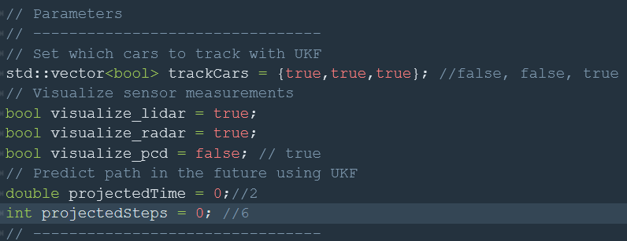
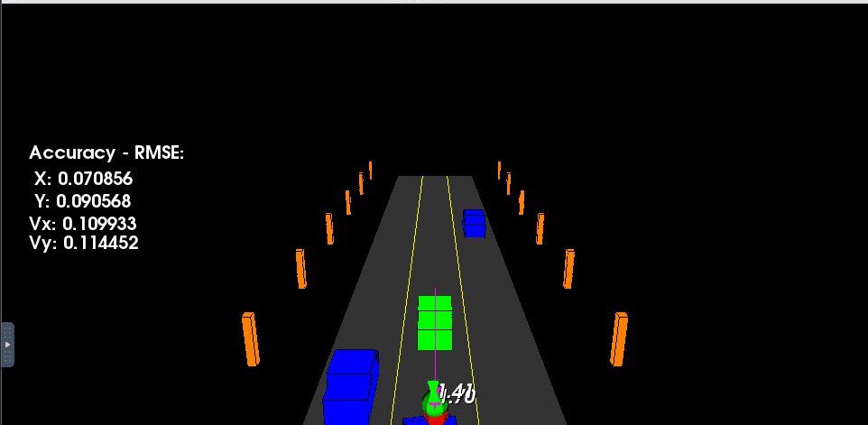
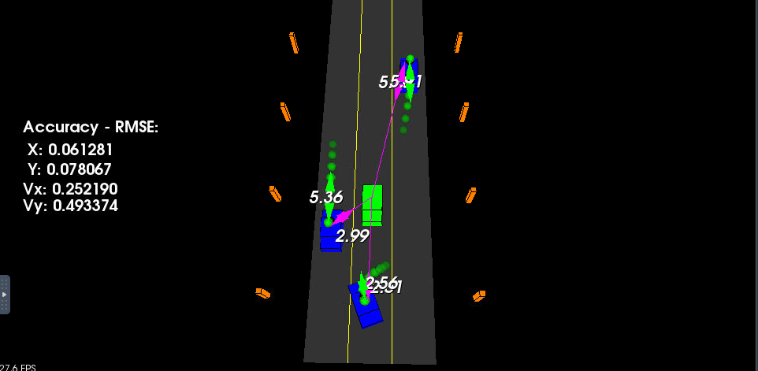
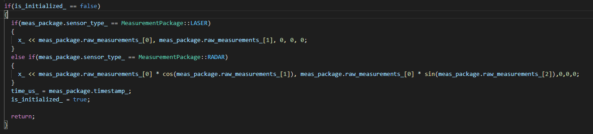

# SFND_Unscented_Kalman_Filter
Sensor Fusion UKF Highway Project


## Important Dependencies
* cmake >= 3.5
  * All OSes: [click here for installation instructions](https://cmake.org/install/)
* make >= 4.1 (Linux, Mac), 3.81 (Windows)
  * Linux: make is installed by default on most Linux distros
  * Mac: [install Xcode command line tools to get make](https://developer.apple.com/xcode/features/)
  * Windows: [Click here for installation instructions](http://gnuwin32.sourceforge.net/packages/make.htm)
* gcc/g++ >= 5.4
  * Linux: gcc / g++ is installed by default on most Linux distros
  * Mac: same deal as make - [install Xcode command line tools](https://developer.apple.com/xcode/features/)
  * Windows: recommend using [MinGW](http://www.mingw.org/)
 * PCL 1.2

## Basic Build Instructions

1. Clone this repo.
2. Make a build directory: `mkdir build && cd build`
3. Compile: `cmake .. && make`
4. Run it: `./ukf_highway`


## Project Rubric Points

#### 1. Compiling and Testing
- [x] The project code must compile without errors using cmake and make.

#### 2. Code Efficiency
- [x] The methods in the code should avoid unnecessary calculations.

#### 3. Accuracy
- [x] px, py, vx, vy output coordinates must have an RMSE <= [0.30, 0.16, 0.95, 0.70] after running for longer than 1 second.

#### 4. Follows the Correct Algorithm
- [x] Your Sensor Fusion algorithm follows the general processing flow as taught in the preceding lessons.


## Test highway.h values


#### 1. Only track 1 car



#### 2. Predicted the path



#### 3. Visualiced data LiDAR


## Code Specifications (ukf.cpp)
- // Process noise standard deviation longitudinal acceleration in m/s^2
  std_a_ = 2; // You can reduce it, but if you increase it, perhaps the RMS max values are supered.

- // Process noise standard deviation yaw acceleration in rad/s^2
  std_yawdd_ = 6; // You can reduce it, but if you increase it, perhaps the RMS max values are supered.


- // Augmented state dimension
  n_aug_ = 7; // You can increase it and the RMS will be reduce a bit. 

- // Sigma point spreading parameter
  lambda_ = 6;


## Main functions (ukf.cpp)
#### 1. ProcessMeasurement -> init




#### 2. Prediction
  ```c++
void UKF::Prediction(double delta_t) {
  /**
   * TODO: Complete this function! Estimate the object's location. 
   * Modify the state vector, x_. Predict sigma points, the state, 
   * and the state covariance matrix.
   */

   VectorXd Vx_aug = VectorXd(n_aug_);
   MatrixXd Mp_aug = MatrixXd(n_aug_, n_aug_);
   MatrixXd Mx_sig = MatrixXd(n_aug_, 2*n_aug_+1);

   Vx_aug.head(5) = x_;
   Vx_aug(5)=0.0;
   Vx_aug(6)=0.0;

   Mx_sig.col(0) = Vx_aug;

   Mp_aug.fill(0.0);
   Mp_aug.topLeftCorner(5,5)= P_;
   Mp_aug(5,5) = std_a_*std_a_;
   Mp_aug(6,6) = std_yawdd_*std_yawdd_;

   MatrixXd Ml = Mp_aug.llt().matrixL();

   for(int i = 0; i < n_aug_; ++i){
    Mx_sig.col(i + 1)          = Vx_aug + sqrt(lambda_ + n_aug_) * Ml.col(i);
    Mx_sig.col(i + 1 + n_aug_) = Vx_aug - sqrt(lambda_ + n_aug_) * Ml.col(i);
  }

  for(int i = 0; i < 2 * n_aug_ + 1; ++i)
  {
    double dp_x = Mx_sig(0, i);
    double dp_y = Mx_sig(1, i);
    double dv = Mx_sig(2, i);
    double dyaw = Mx_sig(3, i);
    double dyawd = Mx_sig(4, i);
    double dnu_a = Mx_sig(5, i);
    double dnu_yawdd = Mx_sig(6, i);

    double dpx_p;
    double dyawd_p;
    double dyaw_p;
    double dpy_p;
    double dv_p;

    if(fabs(dyawd) > 0.001)
    {
      dpx_p = dp_x + dv/dyawd*(sin(dyaw+dyawd*delta_t) - sin(dyaw)) + 0.5*delta_t*delta_t*cos(dyaw)*dnu_a;
      dpy_p = dp_y + dv/dyawd*(-cos(dyaw+dyawd*delta_t) + cos(dyaw)) + 0.5*delta_t*delta_t*sin(dyaw)*dnu_a;
      dv_p = dv + delta_t*dnu_a;
      dyaw_p = dyaw + dyawd*delta_t + 0.5*delta_t*delta_t*dnu_yawdd;
      dyawd_p = dyawd + delta_t*dnu_yawdd;
    }
    else
    {
      dpx_p = dp_x + dv*cos(dyaw)*delta_t + 0.5*delta_t*delta_t*cos(dyaw)*dnu_a;
      dpy_p = dp_y + dv*sin(dyaw)*delta_t + 0.5*delta_t*delta_t*sin(dyaw)*dnu_a;
      dv_p = dv + delta_t*dnu_a;
      dyaw_p = dyaw + dyawd*delta_t + 0.5*delta_t*delta_t*dnu_yawdd;
      dyawd_p = dyawd + delta_t*dnu_yawdd;
    }
    Xsig_pred_(0, i) = dpx_p;
    Xsig_pred_(1, i) = dpy_p;
    Xsig_pred_(2, i) = dv_p;
    Xsig_pred_(3, i) = dyaw_p;
    Xsig_pred_(4, i) = dyawd_p;
  }

  VectorXd V_x = VectorXd::Zero(5);
  MatrixXd M_p = MatrixXd::Zero(5, 5);

  for(int i = 0; i < 2 * n_aug_ + 1; ++i){
    V_x += weights_(i) * Xsig_pred_.col(i);
  }

  for(int i = 0; i < 2 * n_aug_ + 1; ++i){
    VectorXd VVx_diff = Xsig_pred_.col(i) - V_x;

    while(VVx_diff(3) > M_PI){
      VVx_diff(3) -= 2.0*M_PI;
    }
    while(VVx_diff(3) < -M_PI){
      VVx_diff(3) += 2.0*M_PI;
    }

    M_p += weights_(i) * VVx_diff * VVx_diff.transpose();
  }
  x_ = V_x;
  P_ = M_p;
}
```

#### 3. UpdateLidar
```c++
void UKF::UpdateLidar(MeasurementPackage meas_package) {
  /**
   * TODO: Complete this function! Use lidar data to update the belief 
   * about the object's position. Modify the state vector, x_, and 
   * covariance, P_.
   * You can also calculate the lidar NIMs, if desired.
   */
  int n_z_ = 2;
  MatrixXd Mzsig = MatrixXd(n_z_, 2*n_aug_+1);

  VectorXd Vz_pred = VectorXd(n_z_);

  MatrixXd Ms = MatrixXd(n_z_, n_z_);

  for(int i =0; i< 2*n_aug_+1;++i){
    Mzsig(0,i) =  Xsig_pred_(0,i);
    Mzsig(1,i) = Xsig_pred_(1,i);
  }

  Vz_pred.fill(0.0);
  for(int i=0; i<2*n_aug_+1; ++i){
    Vz_pred = Vz_pred + weights_(i)*Mzsig.col(i);
  }

  Ms.fill(0.0);
  for(int i=0; i<2*n_aug_+1; ++i){
    VectorXd Vz_diff = Mzsig.col(i) - Vz_pred;

    while(Vz_diff(1)>M_PI){
      Vz_diff(1)-=2.*M_PI;
    }
    while(Vz_diff(1)<-M_PI){
      Vz_diff(1)+=2.*M_PI;
    }

    Ms = Ms + weights_(i)*Vz_diff*Vz_diff.transpose();
  }
   MatrixXd MR = MatrixXd(n_z_,n_z_);
   MR<< std_laspx_*std_laspx_,0,
        0,std_laspy_*std_laspy_;
  Ms = Ms + MR;

  MatrixXd Mtc = MatrixXd(n_x_,n_z_);
  Mtc.fill(0.0);
  for(int i=0; i<2*n_aug_+1; ++i){
    VectorXd Vz_diff = Mzsig.col(i) - Vz_pred;

    while(Vz_diff(1)>M_PI){
      Vz_diff(1)-=2.*M_PI;
    }
    while(Vz_diff(1)<-M_PI){
      Vz_diff(1)+=2.*M_PI;
    }

    VectorXd Vx_diff = Xsig_pred_.col(i)-x_;

    while(Vx_diff(1)>M_PI){
      Vx_diff(1)-=2.*M_PI;
    }
    while(Vx_diff(1)<-M_PI){
      Vx_diff(1)+=2.*M_PI;
    }

    Mtc = Mtc + weights_(i)*Vx_diff*Vz_diff.transpose();
  }

  MatrixXd MK = Mtc * Ms.inverse();
  VectorXd Vz=meas_package.raw_measurements_;
  VectorXd Vz_diff = Vz - Vz_pred;

  while(Vz_diff(1)>M_PI){
    Vz_diff(1)-=2.*M_PI;
  }
  while(Vz_diff(1)<-M_PI){
    Vz_diff(1)+=2.*M_PI;
  }

  x_ = x_ + MK*Vz_diff;
  P_ = P_ - MK*Ms*MK.transpose();

}
```

#### 4. UpdateRadar
```c++
void UKF::UpdateRadar(MeasurementPackage meas_package) {
  /**
   * TODO: Complete this function! Use radar data to update the belief 
   * about the object's position. Modify the state vector, x_, and 
   * covariance, P_.
   * You can also calculate the radar NIMs, if desired.
   */

  int n_z_ = 3;
  MatrixXd Mzsig = MatrixXd(n_z_, 2*n_aug_+1);

  VectorXd Vz_pred =VectorXd(n_z_);

  MatrixXd Ms = MatrixXd(n_z_, n_z_);

  for(int i =0; i< 2*n_aug_+1;++i){
    double dpx = Xsig_pred_(0,i);
    double dpy = Xsig_pred_(1,i);
    double v = Xsig_pred_(2,i);
    double phi = Xsig_pred_(3,i);
    double phid = Xsig_pred_(4,i);
    double v1 = cos(phi)*v;
    double v2 = sin(phi)*v;

    Mzsig(0,i) = sqrt(dpx*dpx +dpy*dpy);
    Mzsig(1,i) = atan2(dpy,dpx);
    Mzsig(2,i) = (dpx*v1 + dpy*v2)/ sqrt(dpx*dpx + dpy*dpy);
  }

  Vz_pred.fill(0.0);
  for(int i=0; i<2*n_aug_+1; ++i){
    Vz_pred = Vz_pred + weights_(i) * Mzsig.col(i);
  }

  Ms.fill(0.0);
  for(int i=0; i<2*n_aug_+1; ++i){
    VectorXd Vz_diff = Mzsig.col(i) - Vz_pred;

    while(Vz_diff(1)>M_PI){
      Vz_diff(1) -= 2. * M_PI;
    }
    while(Vz_diff(1)<-M_PI){
      Vz_diff(1) += 2. * M_PI;
    }

    Ms = Ms + weights_(i) * Vz_diff * Vz_diff.transpose();
  }
   MatrixXd MR = MatrixXd(n_z_,n_z_);
   MR<< std_radr_*std_radr_,0,0,
        0,std_radphi_*std_radphi_,0,
        0,0,std_radrd_*std_radrd_;
  Ms = Ms + MR;

  MatrixXd Mtc = MatrixXd(n_x_,n_z_);
  Mtc.fill(0.0);
  for(int i=0; i<2*n_aug_+1; ++i){
    VectorXd Vz_diff = Mzsig.col(i) - Vz_pred;

    while(Vz_diff(1)>M_PI){
      Vz_diff(1) -= 2. * M_PI;
    }
    while(Vz_diff(1)<-M_PI){
      Vz_diff(1) += 2. * M_PI;
    }

    VectorXd Vx_diff = Xsig_pred_.col(i)-x_;

    while(Vx_diff(1)>M_PI){
      Vx_diff(1) -= 2. * M_PI;
    }
    while(Vx_diff(1)<-M_PI){
      Vx_diff(1) += 2. * M_PI;
    }

    Mtc = Mtc + weights_(i) * Vx_diff * Vz_diff.transpose();
  }

  MatrixXd MK = Mtc *Ms.inverse();
  VectorXd Vz = meas_package.raw_measurements_;
  VectorXd Vz_diff = Vz-Vz_pred;

  while(Vz_diff(1)>M_PI){
    Vz_diff(1) -= 2. * M_PI;
  } 
  while(Vz_diff(1)<-M_PI){
    Vz_diff(1) += 2. * M_PI;
  }

  x_ = x_ + MK * Vz_diff;
  P_ = P_ - MK * Ms * MK.transpose();
}
```

